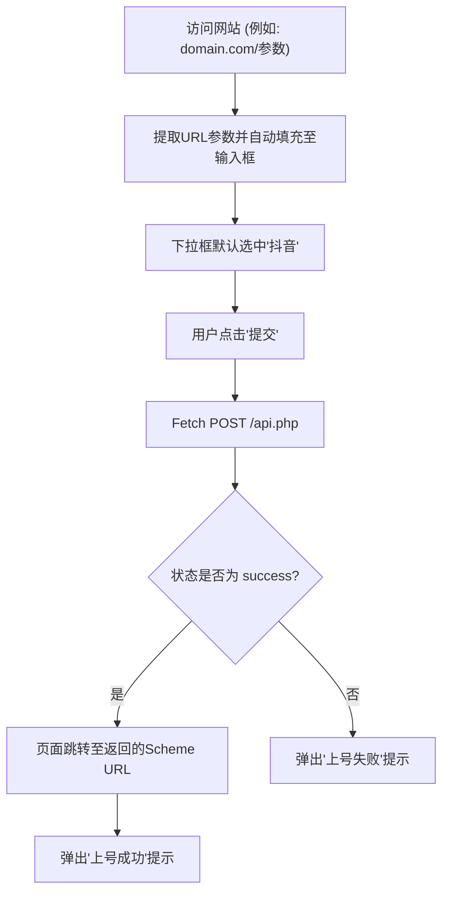

## 1. 产品概述
构建一个类似于“OP登录器”的第三方跳转与数据号提交网站。
- **主要目的**：允许用户通过在URL后附加数据号参数，快速填充数据并提交到后端API，从而唤醒对应的手机应用（默认抖音）。
- **目标用户**：需要快速通过数据号唤醒特定App进行登录或操作的用户。
- **核心价值**：简化原版网站的输入流程，通过URL传参实现自动化填充，并提升前端页面的现代感和视觉美感。

## 2. 核心功能

### 2.1 功能模块
1. **主页**：包含通告栏、数据号输入框、游戏选择下拉框、提交按钮以及上号教程说明。

### 2.2 页面详情
| 页面名称 | 模块名称 | 功能描述 |
|-----------|-------------|---------------------|
| 主页 | 自动解析模块 | 页面加载时，自动解析URL中 `/` 后的参数（即路径参数或hash参数），并自动填充至“数据号URL”输入框中。 |
| 主页 | 表单提交模块 | 包含“数据号URL”文本框和“选择游戏”下拉框。下拉框默认选中“抖音”。提交时拦截默认跳转，使用 fetch POST 提交数据至 `https://www.opdengluqi.com/api.php`。 |
| 主页 | 结果响应模块 | 成功返回后，页面重定向至返回的 scheme URL 以唤醒应用，并弹出成功提示；失败则弹出错误提示。 |
| 主页 | 教程展示模块 | 在页面下方美观地展示使用教程，引导用户操作。 |

## 3. 核心流程
用户通过带有参数的URL访问网站 -> 系统自动提取URL后缀填充输入框 -> 下拉框默认选择“抖音” -> 用户点击“提交” -> 发送POST请求至API -> 根据返回的Scheme URL唤醒本地App。

## 4. 用户界面设计

### 4.1 设计风格
- **整体基调**：现代、极简、高质感（Modern & Refined Minimalism）。摈弃原版老旧的表单设计，采用更加通透的卡片式布局。
- **色彩与主题**：
  - 主色调：采用沉稳的暗夜黑（Dark Mode）或清新的磨砂玻璃白（Glassmorphism），此处选择**高级毛玻璃（Glassmorphism）与现代光影结合**的风格，主色为纯净的白色背景搭配微弱的渐变光晕。
  - 强调色：采用带有活力的品牌色（如渐变蓝紫或抖音特征色）。
- **字体**：使用现代无衬线字体，如系统默认的 `-apple-system, BlinkMacSystemFont, "Segoe UI", Roboto`，标题可尝试更大胆的排版。
- **布局风格**：居中对齐的卡片式布局，增加留白（Negative Space），圆角（Border Radius）与柔和阴影（Soft Drop Shadows）。
- **交互动画**：按钮悬停状态有平滑的颜色与缩放过渡；加载状态（Loading）有清晰的视觉反馈；弹窗提示使用更现代的轻量级 Toast 提示而非原生的 `alert()`（考虑到纯原生限制，可使用自定义UI或美化的原生弹窗）。

### 4.2 页面设计概览
| 页面名称 | 模块名称 | UI 元素说明 |
|-----------|-------------|-------------|
| 主页 | 主标题与公告 | 采用大号加粗无衬线字体，背景可使用柔和的网格或纹理。 |
| 主页 | 表单卡片 | 悬浮感卡片设计（带阴影），输入框去除粗糙边框，采用底部下划线或轻量灰色背景；下拉框统一样式，去掉原生默认丑陋的箭头；按钮采用渐变色或实色块，附带点击动效。 |
| 主页 | 教程区块 | 在卡片下方使用较小号、低对比度颜色的文字进行排版，行距宽松，易于阅读。 |

### 4.3 响应式设计
- **优先移动端（Mobile-First）**：由于核心操作是唤醒手机App，页面将在移动端展现出最佳状态。宽度自适应，触控目标（按钮、输入框）尺寸至少为 44px 以提升点击体验。在桌面端则限制最大宽度并居中显示。
