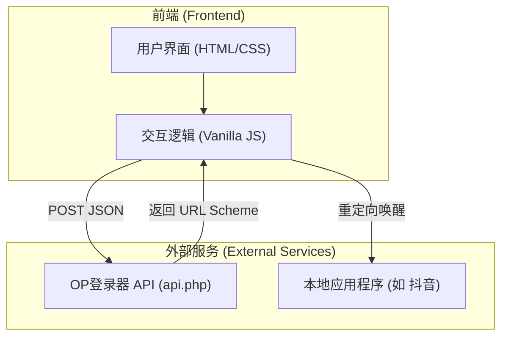

## 1. 架构设计
本项目为纯前端单页应用（SPA）或静态HTML页面，通过客户端 Fetch API 直接与第三方后端接口交互。考虑到项目的轻量级特性与单页需求，将使用纯 HTML/CSS/JavaScript 构建，但采用现代的前端工程化开发体验或高度结构化的静态文件。



## 2. 技术说明
- **前端技术栈**：HTML5 + CSS3 + Vanilla JavaScript (ES6+)。不使用沉重的框架（如 React/Vue），以保证极速加载和最简部署。
- **样式方案**：原生 CSS 搭配 CSS Variables，实现高级的毛玻璃效果（Glassmorphism）和现代 UI 组件样式。使用 Google Fonts 或系统默认现代字体。
- **构建/部署**：单文件 `index.html` 或极简目录结构（可直接部署至 Vercel, GitHub Pages 或任意静态服务器）。
- **API 通信**：使用原生的 `fetch` API 进行网络请求，处理 Promise 异步逻辑。考虑到跨域问题（CORS），由于是调用第三方 API `https://www.opdengluqi.com/api.php`，如果在浏览器端直接请求出现跨域拦截，可能需要在使用时配置反向代理或确保第三方接口支持跨域（目前已知第三方接口用于直接提交）。如遇严格跨域限制，可提示使用代理转发。

## 3. 路由定义
由于是单页静态网站，没有复杂的路由。
| 路由 | 目的 |
|-------|---------|
| `/` 或 `/?id=...` 或 `/#/...` | 主页，承载所有的输入、选择、提交与展示逻辑。 |

*注：为了实现“提取网址/后面的参数”，我们将通过 JavaScript 获取 `window.location.pathname`、`window.location.search` 或 `window.location.hash` 来灵活截取数据号参数。*

## 4. API 定义 (第三方)
| 接口 | 方法 | 说明 |
|-------|---------|---------|
| `https://www.opdengluqi.com/api.php` | POST | 提交数据号与游戏ID，换取唤醒 Scheme |

**请求参数 (Request Payload - JSON)**:
```json
{
  "url": "string (数据号)",
  "game": "string (游戏ID，如抖音为 1105602870)"
}
```

**响应参数 (Response Schema)**:
```json
{
  "status": "success",
  "url": "tencent1105602870://..."
}
```

## 5. 数据模型
本项目不涉及本地复杂数据存储，无数据库与后端逻辑，数据在内存中流转并即时发送。
