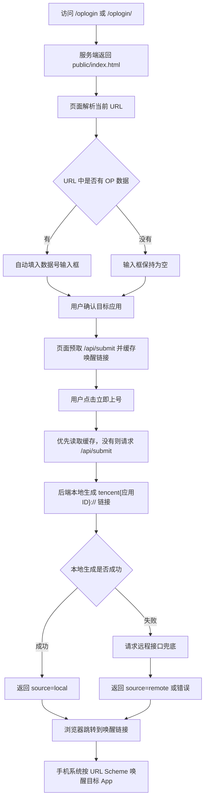

# /oplogin 页面逻辑说明

本文档说明公开上号页 `/oplogin` 的完整逻辑，包括访问入口、页面取值、提交接口、唤醒链接生成，以及它和后台 OP 记录的关系。

## 1. 页面定位

`/oplogin` 是公开上号页，不是后台登录页。

- 公开上号页：`/oplogin`
- 后台登录页：`/admin/login`
- 页面文件：`public/index.html`
- 路由文件：`routes/public-fallback.js`
- 提交接口：`POST /api/submit`

访问 `/oplogin` 或 `/oplogin/<OP数据>` 时，服务端都会返回 `public/index.html`。

## 2. 服务端路由逻辑

服务端在 `routes/public-fallback.js` 中注册了这个路由：

```js
router.get(/^\/oplogin(?:\/.*)?$/, (req, res) => {
  res.sendFile(indexFilePath);
});
```

含义是：

- `/oplogin` 可以访问
- `/oplogin/任意内容` 也可以访问
- 返回的都是同一个静态页面 `public/index.html`

另外，`app.js` 里有一个 `/:username` 用户专属页拦截逻辑，但它明确排除了 `oplogin`：

```js
if (['admin', 'api', 'favicon.ico', 'oplogin'].includes(username)) {
  return next();
}
```

所以即使后台里存在一个用户名叫 `oplogin`，`/oplogin` 也不会被当成用户专属页，而是固定进入公开上号页。

## 3. 页面加载后的取值逻辑

页面加载后会执行 `extractInitialOpValue()`，自动从当前地址里提取 OP 数据号。

支持三种形式：

```text
/oplogin
/oplogin/AAA%7CBBB%7CCCC
/oplogin?AAA%7CBBB%7CCCC
/oplogin#AAA%7CBBB%7CCCC
```

具体规则：

- 如果路径是 `/oplogin`，输入框为空。
- 如果路径是 `/oplogin/<内容>`，会把 `<内容>` 解码后填进“数据号 URL”输入框。
- 如果 URL 上有 `?xxx`，会把查询参数内容解码后填入。
- 如果 URL 上有 `#xxx`，会把 hash 内容解码后填入。

例如：

```text
/oplogin/AAA%7CBBB%7CCCC
```

页面会自动填入：

```text
AAA|BBB|CCC
```

## 4. 页面表单逻辑

页面核心表单包含两个字段：

- `url`：OP 数据号，也就是页面上的“数据号 URL”
- `game`：目标应用 ID，也就是下拉框里的应用

默认选中的应用是抖音：

```html
<option value="1105602870" selected>抖音</option>
```

这个 `1105602870` 会被后端拼进最终的唤醒协议：

```text
tencent1105602870://...
```

这里的 `tencent1105602870` 不是打开腾讯 App，而是 iOS/应用侧注册的 URL Scheme。哪个 App 注册了这个 Scheme，就会被系统唤醒。当前配置里 `1105602870` 对应抖音，所以它会打开抖音。

## 5. 预取和缓存逻辑

页面引入了：

```html
<script src="/op-wake-url-cache.js"></script>
```

这个脚本会创建一个浏览器内存缓存 `wakeUrlCache`。

当用户修改数据号或目标应用时，页面会提前调用：

```js
wakeUrlCache.prefetch(urlInput, gameInput)
```

这样做的目的：

- 提前请求后端生成唤醒链接
- 同一个 OP 数据号 + 同一个应用，不重复请求
- 用户点击“立即上号”时，优先直接用缓存结果

缓存 key 是：

```text
OP数据号 + 换行符 + 应用ID
```

所以同一个数据号切换不同应用，会分别缓存。

## 6. 点击“立即上号”的流程

用户点击“立即上号”后，页面执行 `submitData()`：

1. 读取输入框里的 OP 数据号。
2. 读取当前选择的目标应用 ID。
3. 如果 OP 数据号为空，提示“请输入数据号 URL”。
4. 按钮文字改成“正在处理...”，并临时禁用按钮。
5. 先查缓存里有没有已经生成好的唤醒链接。
6. 如果没有缓存，就请求 `/api/submit`。
7. 成功后提示“上号成功，正在唤起应用...”。
8. 延迟 800ms 后执行：

```js
window.location.href = wakeUrl;
```

这一步会让浏览器跳转到类似下面的协议地址：

```text
tencent1105602870://qzapp/mqzone/0?objectlocation=url&pasteboard=...
```

手机系统收到这个协议后，会尝试唤醒对应 App。

## 7. `/api/submit` 接口逻辑

页面实际提交到：

```text
POST /api/submit
```

请求体格式：

```json
{
  "url": "OP数据号",
  "game": "目标应用ID"
}
```

后端处理逻辑在 `routes/api-submit.js`：

1. 校验 `url` 和 `game` 是否存在。
2. 优先调用本地方法 `buildWakeUrl(url, game)` 生成唤醒链接。
3. 本地生成成功时返回：

```json
{
  "status": "success",
  "url": "tencent1105602870://...",
  "source": "local"
}
```

4. 如果本地生成失败，会请求远程接口兜底：

```text
https://www.opdengluqi.com/api.php
```

5. 远程兜底成功时返回的数据会带上：

```json
{
  "source": "remote"
}
```

6. 本地和远程都失败时，接口返回 500 错误。

## 8. 本地唤醒链接生成逻辑

本地生成逻辑在 `lib/op-url.js`。

OP 数据号要求至少包含前三段：

```text
openid|access_token|pay_token
```

代码会取：

- 第一段：`openid`
- 第二段：`access_token`
- 第三段：`pay_token`

然后把这些字段写入一个二进制 plist，转成 base64，放到 `pasteboard` 参数里。

最终生成格式：

```text
tencent{应用ID}://qzapp/mqzone/0?objectlocation=url&pasteboard={base64内容}
```

例如抖音默认应用 ID 是 `1105602870`，最终就是：

```text
tencent1105602870://qzapp/mqzone/0?objectlocation=url&pasteboard=...
```

## 9. 和后台 OP 记录的关系

后台保存或导入 OP 数据时，会自动派生一个 OP 链接。

逻辑在 `lib/managed-records.js`：

```js
function buildDerivedOpLink(opValue) {
  const normalizedOpValue = String(opValue || '').trim();
  return normalizedOpValue
    ? `/oplogin/${encodeURIComponent(normalizedOpValue)}`
    : '';
}
```

也就是说，如果后台记录里有 OP 数据：

```text
AAA|BBB|CCC
```

系统会自动生成：

```text
/oplogin/AAA%7CBBB%7CCCC
```

用户打开这个链接后，`/oplogin` 页面会自动把 OP 数据填入输入框，然后用户选择应用并点击“立即上号”。

## 10. 整体流程图



## 11. 简单总结

`/oplogin` 的核心作用是：

1. 接收一个 OP 数据号。
2. 选择目标应用 ID。
3. 生成 `tencent{应用ID}://...` 唤醒链接。
4. 通过浏览器跳转唤醒手机里的目标 App。

它本身不做后台登录，也不查数据库；数据库里的 OP 记录只是会生成指向 `/oplogin/<OP数据>` 的便捷链接。
